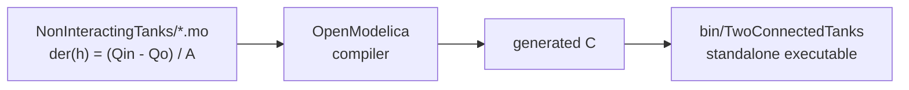
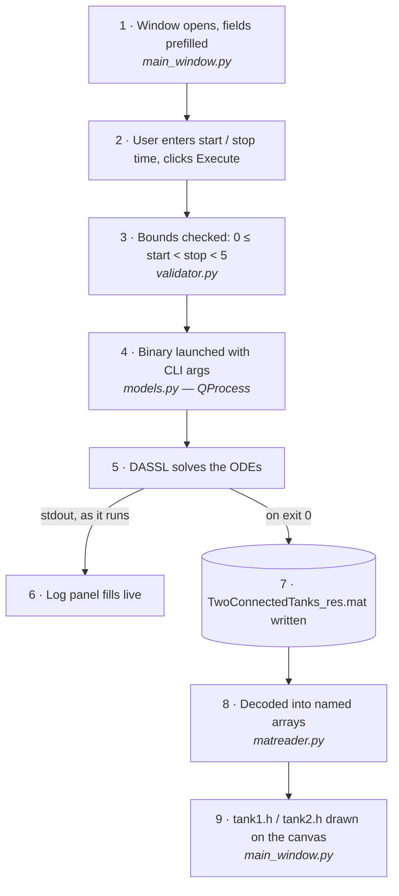

# OpenModelica Simulation Manager

A desktop app that runs a compiled OpenModelica model, streams its output live, and plots the results.

[View a screenshot of the running app →](docs/simulation-window.png)

---

## What it does

The app is a thin wrapper around a compiled Modelica simulation. Building the model and running it are two separate stages.

### Step 1 — Build the model (once, in OMEdit)

Done ahead of time. The app never compiles anything.



### Step 2 — Run the app (`python main.py`)



Three things carry the weight:

- **`QProcess`, not `subprocess`** — the solver runs asynchronously, so the window stays responsive and the log fills line by line instead of dumping at the end.
- **`matreader.py`** — OpenModelica's `.mat` stores names as a *transposed* character matrix and splits values across two data blocks, with `dataInfo` mapping each name onto a row and a sign. Read naively, the variable names come out as garbage.
- **Qt signals** — the process runner emits `output_received` / `finished` and knows nothing about the GUI, so either side can change alone.

### The simulated model

Two tanks connected by a pipe. Tank 1 has a constant inflow and a valve that opens at `t = 5 s`; tank 2 collects whatever leaves tank 1 and has no outlet.

```
Tank 1:  der(h₁) = (Qin − Qo) / A        Qo = 0        if t ≤ 5
                                         Qo = √h₁      otherwise
Tank 2:  der(h₂) = Qo / A
```

| Parameter | Value | Meaning |
|---|---|---|
| `Qin` | 2 | inflow into tank 1 |
| `A` | 1 | cross-section area (both tanks) |
| `V` | 10 | tank 2 volume, used for residence time |

**Resulting behaviour**

| Phase | Tank 1 | Tank 2 |
|---|---|---|
| `t ≤ 5` | rises linearly, `h₁ = 2t` | flat at 0 — valve shut |
| `t > 5` | drains toward equilibrium `h₁ = 4` | fills steadily, slope → 2 |

Mass is conserved exactly: `h₁ + h₂ = 2t` at all times.

---

## Tech stack

| Component | Role |
|---|---|
| **OpenModelica** | compiles the Modelica model; DASSL solver produces the `.mat` result |
| **PyQt6** | GUI, plus `QProcess` to run the solver without freezing the window |
| **Matplotlib** | plot embedded directly in the Qt widget tree |
| **SciPy / NumPy** | decode the binary `.mat` result file |

---

## Setup

**Prerequisites**

- Python 3.12+
- Linux x86-64 — the bundled `bin/TwoConnectedTanks` is a Linux binary
- OpenModelica — only if you want to rebuild the model from `NonInteractingTanks/`

```bash
git clone https://github.com/Vidit-lab/OpenModelicaApp.git
cd OpenModelicaApp

python -m venv venv
source venv/bin/activate
pip install -r requirements.txt

python main.py
```

Set a start and stop time, hit **Execute Simulation**. The log fills as the solver runs and both tank levels are plotted when it finishes.

---

## Project structure

| File | Responsibility |
|---|---|
| `main.py` | entry point |
| `src/main_window.py` | GUI layout, plot rendering |
| `src/models.py` | launches the solver via `QProcess`, streams stdout/stderr |
| `src/validator.py` | input bounds checking |
| `src/matreader.py` | decodes the OpenModelica `.mat` result into named arrays |
| `NonInteractingTanks/` | the Modelica source model |
| `bin/` | compiled model and simulation output |

`src/matreader.py` and `src/validator.py` each carry a self-check — run either directly to verify it.

---

## Limitations

- **Stop time is capped below 5 s**, so the GUI can only ever show the pre-valve ramp. Every interesting dynamic happens after `t = 5`.
- **Tank 2 never overflows** — it has no outlet, so its level grows without bound.
- The compiled binary is platform-specific; there is no build step in the repo.

## Future improvements

- Raise the stop-time cap and let the valve event appear in the app
- Variable picker, so any signal in the result file can be plotted
- Export plot and result data
- Build the Modelica model from source instead of shipping a binary

---

## License

[MIT](LICENSE)
